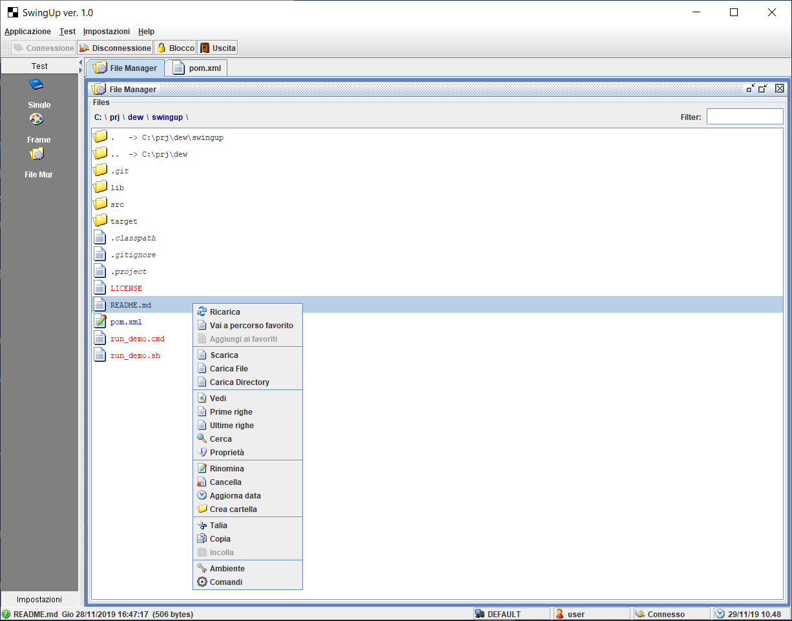

# Swingup

A simple framework to build swing based application.

## Build

- `git clone https://github.com/giosil/swingup.git`
- `mvn clean install`

## Run

### On Windows

`"%JAVA_HOME%"\bin\java -cp ./target/swingup-1.0.0.jar;./lib/swing3rd.jar -Djsenv=demo org.dew.swingup.main.Main`

### On Linux

`"$JAVA_HOME"/bin/java -cp ./target/swingup-1.0.0.jar:./lib/swing3rd.jar -Djsenv=demo org.dew.swingup.main.Main`

## Contributors

* [Giorgio Silvestris](https://github.com/giosil)
